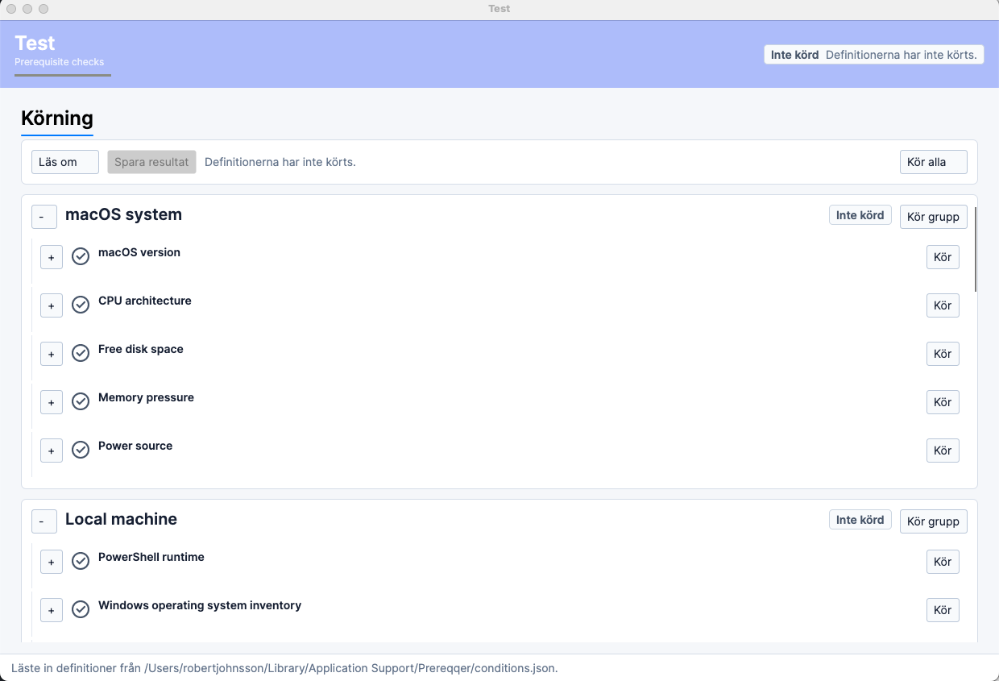

# Prereqqer

Prereqqer is a cross-platform .NET desktop application for running prerequisite checks grouped by area. It supports WMI queries on Windows and trusted PowerShell scripts on Windows, macOS, and Linux.



## Run

```bash
dotnet run --project src/Prereqqer.App/Prereqqer.App.csproj
```

The app stores its local definition file at the platform app-data path shown in the admin view and status bar.

To load definitions from a remote JSON URL at startup:

```bash
dotnet run --project src/Prereqqer.App/Prereqqer.App.csproj -- --config-url https://example.com/prereqqer-conditions.json
```

Supported URL launch parameters are `--config-url`, `--configuration-url`, `--definition-url`, and `--definitions-url`. The downloaded document is validated against the same model as local JSON, then cached to the local definition file. If the URL cannot be fetched, the app falls back to the local cached file and reports the failure in the status bar.

To start with the admin design view visible:

```bash
dotnet run --project src/Prereqqer.App/Prereqqer.App.csproj -- --design
```

Supported design-mode launch parameters are `--design`, `--design-mode`, and `--admin`. During startup, design mode can also be enabled with the platform meta key plus `A`: Win+A, Super+A, or Command+A.

## Branding

The JSON definition file includes a `branding` section:

- `applicationName`
- `subtitle`
- `headerBackgroundColor`
- `headerForegroundColor`
- `accentColor`

The admin design view can edit those values. Normal runtime only shows the runtime check view.

On macOS, `dotnet run` and `./scripts/package-macos.sh` create an `.app` bundle whose Dock
title is generated from the saved `branding.applicationName` value in the local definition
file. Set `PREREQQER_BRAND_NAME` to override the bundle title for a single run or package.

## Configuration Source

The JSON definition file can include a `configurationSource` section:

- `url`
- `fetchOnStartup`
- `timeoutSeconds`

In admin design mode, the Configuration Source panel can fetch a URL immediately and cache it locally. When `fetchOnStartup` is enabled, normal runtime fetches the URL on launch and falls back to the cached local file if the remote source is unavailable.

## Outcomes

Checks return one of four outcomes:

- `Passed`
- `PassedWithWarning`
- `Warning`
- `Error`

Overall readiness fails only when a condition returns `Error`.

Runtime users can run all groups, one group, or one condition row. Rows show a running indicator while an individual check is executing, and groups can be collapsed in the runtime list. Current run results can be saved as JSON from the runtime toolbar.

## Condition Types

- `PowerShell`: runs an admin-defined trusted script in-process through the PowerShell SDK, with parse validation, timeout handling, output capture, warning capture, and error-stream failure handling.
- `Wmi`: runs a WQL query through `System.Management` on Windows. On macOS and Linux, WMI conditions return `Warning` with an unsupported-platform message.

Each condition can set `requiresElevation` to indicate that the check expects elevated privileges. The runtime view displays that requirement next to the condition.

## Rule Model

Rules are evaluated in order, and the first matching rule determines the outcome. If no rule matches, a successful execution returns `Passed`, or `PassedWithWarning` when PowerShell warnings were captured.

Each condition can define a `recommendedAction`. Outcome rules can also define `recommendedAction`; when a rule matches, its recommended action is shown instead of the condition default. The admin design view labels this field as `Rekommenderad åtgärd`.

Targets:

- `RowCount`
- `FirstRow`
- `AnyRow`
- `AllRows`
- `Scalar`

Operators:

- `Exists`
- `NotExists`
- `Equals`
- `NotEquals`
- `GreaterThan`
- `GreaterThanOrEqual`
- `LessThan`
- `LessThanOrEqual`
- `Contains`
- `NotContains`
- `RegexMatch`
- `RegexNotMatch`

## Test And Publish

```bash
dotnet test Prereqqer.slnx

dotnet run --project src/Prereqqer.App/Prereqqer.App.csproj

dotnet publish src/Prereqqer.App/Prereqqer.App.csproj -c Release -r win-x64 --self-contained false -o artifacts/publish/win-x64
./scripts/package-macos.sh osx-arm64
dotnet publish src/Prereqqer.App/Prereqqer.App.csproj -c Release -r linux-x64 --self-contained false -o artifacts/publish/linux-x64
```

The macOS script creates `artifacts/package/osx-arm64/Prereqqer.app`, including `Info.plist`
and the `prereqqer-icon.icns` bundle icon.
